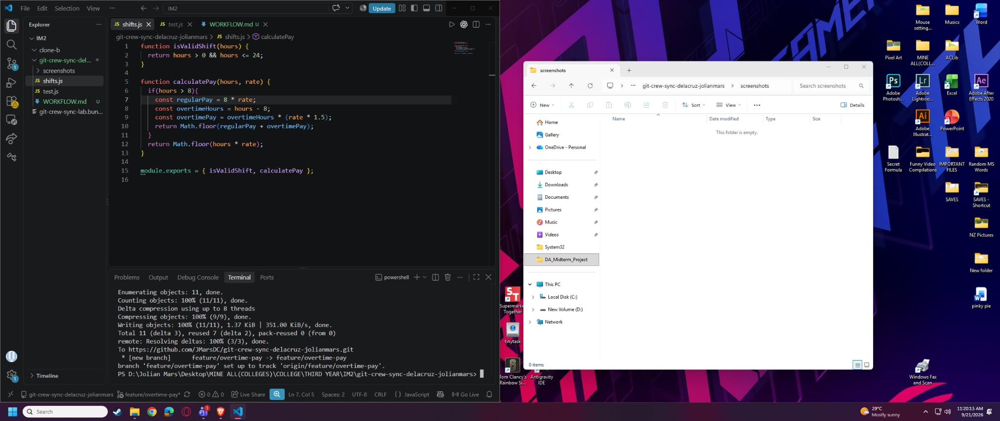
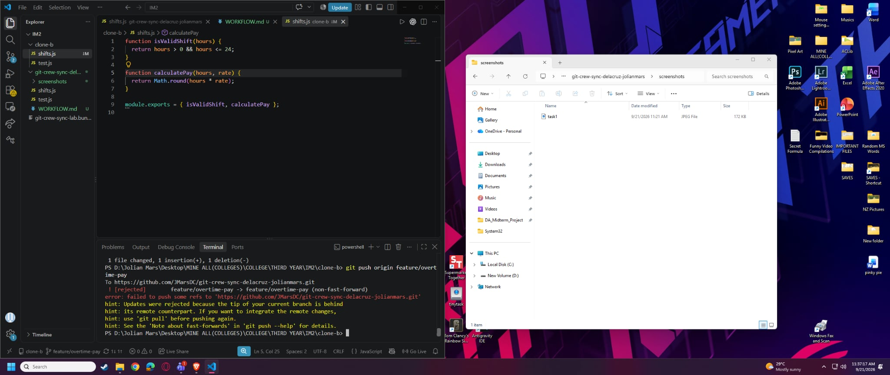
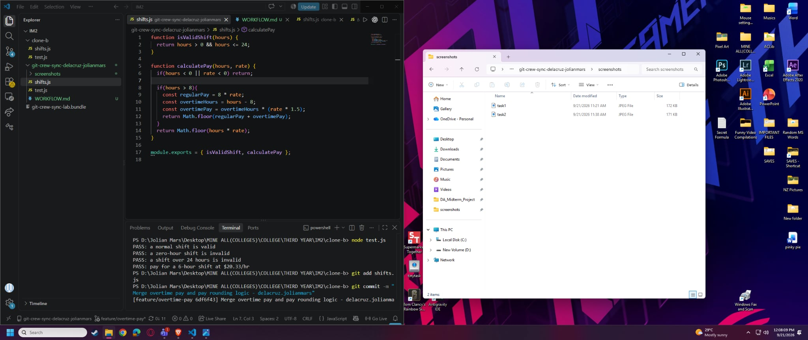
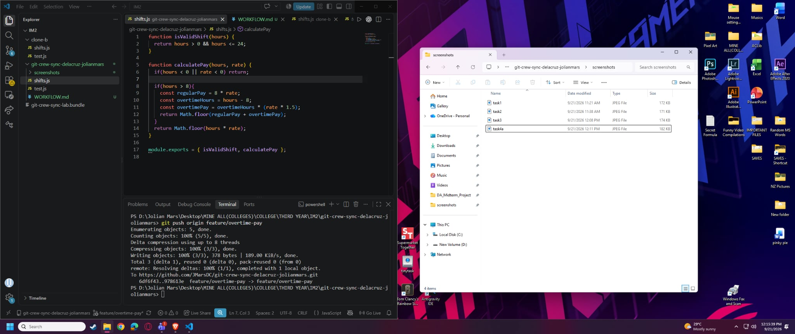
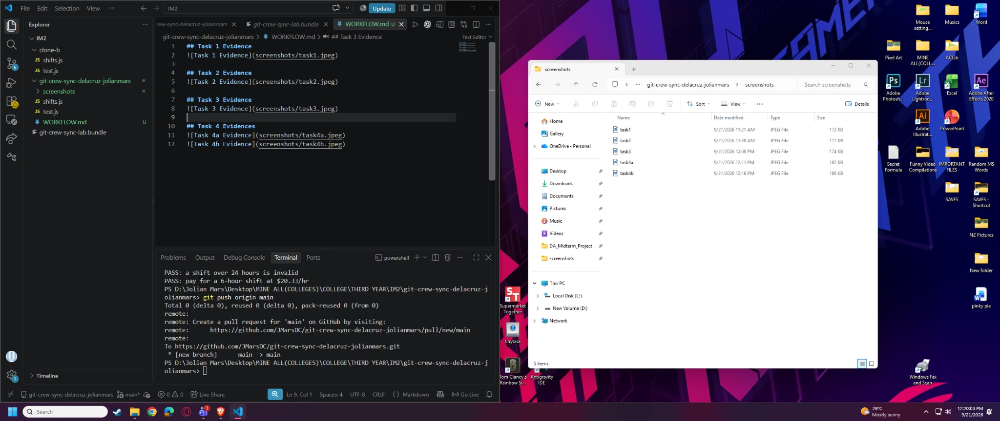
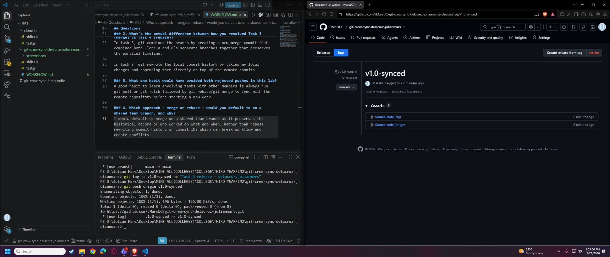

## Task 1 Evidence

## Task 2 Evidence

## Task 3 Evidence

## Task 4 Evidences

## Task 5 Evidence

## Task 6 Evidence

## Questions

### 1. What did the rejected push error message tell you, and why did it happen?
The error message pointed out `! [rejected]` because the remote branch contained commits that did not exist in my local repository. It happened because Clone A already pushed to GitHub, meanwhile my Clone B out of date, Git blocked the push to prevent overwritting the remote commits.

### 2. What's the actual difference between how you resolved Task 3 (merge) vs Task 4 (rebase)?
In task 3, git combined the branch by creating a new merge commit that combined both Clone A and B's separate branches together that preserves the parallel timeline.

In task 3, git rewrote the local commit history by taking my local changes and appending them directly on top of the remote commits.

### 3. What one habit would have avoided both rejected pushes in this lab?
A good habit to learn envolving tasks with other members is always run git pull or git fetch followed by git rebase/git merge to sync with the remote repositoty before starting a new work.

### 4. Which approach - merge or rebase - would you default to on a shared team branch, and why?
I would default to merge on a shared team branch as it preserves the historical record of who worked on what and when. Rather than rebase rewriting commit history or commit IDs which can break workflow and create conflicts.